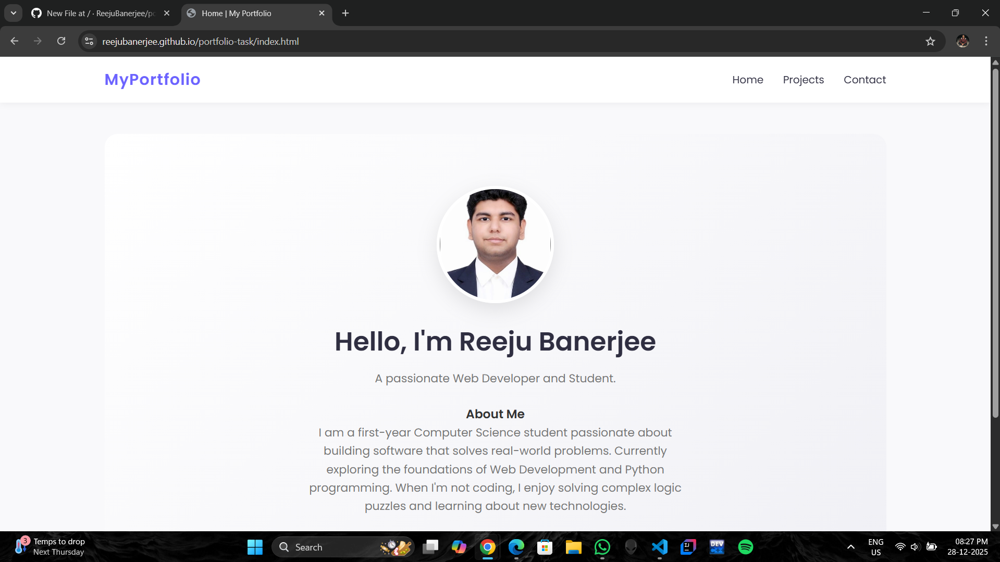

# 👨‍💻 Personal Portfolio Website


A clean, responsive, multi-page personal portfolio website designed to showcase my projects and skills. This project was built to demonstrate proficiency in **Semantic HTML**, **Modern CSS**, and **Responsive Design**.

## 🚀 Live Demo
**[Click here to view the Live Website](https://reejubanerjee.github.io/portfolio-task/index.html)**

---

## 📖 About
This is the Task 1 submission for creating a standard personal website. The goal was to maintain a consistent layout and navigation across multiple pages while ensuring the code is clean and organized.

### Key Pages:
1.  **Home:** A hero section with a profile introduction.
2.  **Projects:** A grid layout showcasing recent work using CSS Grid.
3.  **Contact:** A styled contact form and social media links.

---

## ✨ Features
* **Consistent Navigation:** Seamless navigation bar across all pages.
* **Responsive Design:** Uses CSS Grid and Flexbox to adapt to different screen sizes.
* **Modern Styling:** * Google Fonts (Poppins) for clean typography.
    * CSS Variables for easy color theme management.
    * Hover effects for better user interactivity.
* **Clean Code Structure:** CSS is separated from HTML for better maintainability.

---

## 🛠️ Technologies Used
* **HTML5** - For structure and semantic markup.
* **CSS3** - For styling, including Flexbox, Grid, and Animations.
* **Git & GitHub** - For version control and hosting (GitHub Pages).

---

## 📸 Screenshots

### Home Page


---

## 💻 How to Run Locally

If you want to view this project on your local machine:

1.  **Clone the repository:**
    ```bash
    git clone [https://github.com/](https://github.com/)[YOUR-USERNAME]/portfolio-task.git
    ```

2.  **Navigate to the project folder:**
    ```bash
    cd portfolio-task
    ```

3.  **Open the project:**
    * Simply double-click `index.html` to open it in your browser.
    * Or, if you use VS Code, install the "Live Server" extension and click "Go Live".

---

## 📬 Contact
* **Name:** Reeju Banerjee
* **LinkedIn:** https://www.linkedin.com/in/reejubanerjee/
* **GitHub:** https://github.com/ReejuBanerjee

---
*© 2025 Reeju Banerjee. All Rights Reserved.*
